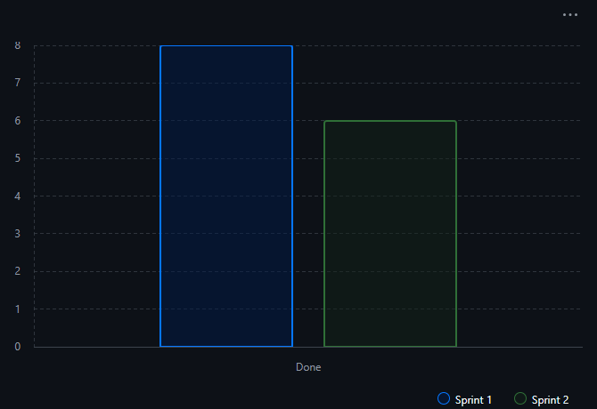
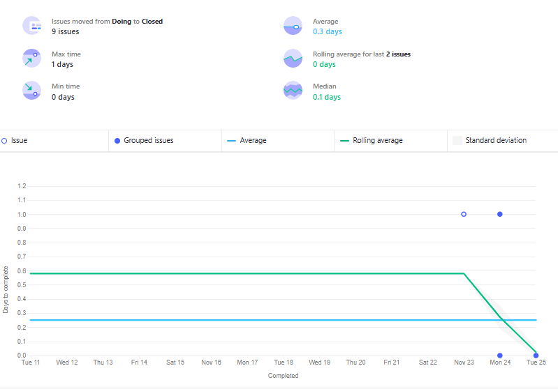

## Throughput 

Sprint 1


Sprint 2



## Lead time

Sprint 1


Sprint 2



## WIP

### Sprint 1

Como máximo se acordaron hacer 5 tareas simulatenamente. Solo se llegaron a alcanzar 4 como máximo.

### Sprint 2

Como máximo se acordaron hacer 4 tareas simultaneamente. Solo se llegaron a alcanzar 3 como máximo.

## Vulnerabilidades detectadas

- **Sprint 1**: Al término de este, no se implementaron las reglas de seguridad. Se tuvo que esperar hasta el sprint 2.

## Métrias de checker de policy as code

```
[2025-11-25/17:08:25]
    Tiempo de despliegue: 3 segundos
    
[2025-11-25/17:09:47]
    Tiempo de despliegue: 3 segundos
    
[2025-11-25/18:49:29]
    Tiempo de despliegue: 2 segundos
```